# Way of the Warrior
 Way of the Warrior is a website dedicated to sharing information about the art of Kung Fu. 
 The site is targeting everyone who is seeking to improve their health, body, and mindfulness through the practice of a martial art.
 Way of the Warrior serves as a valuable resource for individuals seeking their first insights into Kung Fu, its various styles, and the opportunity to participate in actual classes. 
 Users can easily access information about the training schedule, make informed decisions about attendance, explore pricing options, and effortlessly reach out to the school for additional details.

 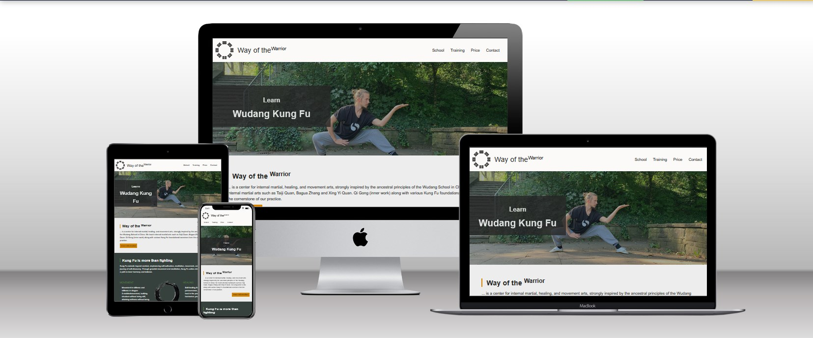

 The website is live at [https://pbrdys.github.io/way-of-the-warrior/](https://pbrdys.github.io/way-of-the-warrior/)

## Features 
This section describes the different parts of the Way of the Warrior site. 

### Existing Features

- __Favicon__
    - This feature enhances brand recognition and user experience by providing a distinctive visual identity in browser tabs and bookmarks, making it easier for users to locate and return to the site.
    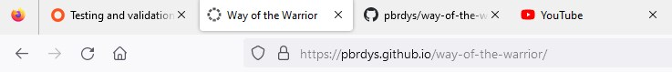

- __Navigation Bar__
    - The Navifation bar is featured on all pages, it includes links to the Home page (school), Training, Pricing and Contact page and is identical in each page to allow for easy navigation.
    - This section will allow the user to easily navigate from page to page across all devices without having to revert back to the previous page via the ‘back’ button.
    - The navigation bar highlights the active page, ensuring a intuitive user experience. 
    - The navigation bar sticks to the top of the page, ensuring it remains accessible to the user at all times, eliminating the need to scroll up for site navigation.
    

- __All Pages: Hero Image__
    - This section features an image that serves as an eye-catcher to capture the user's attention, accompanied by a meaningful headline that informs the user of their location on the page and what to expect on this page.
    - This feature is implemented on the following pages: School, Training, Price, Contact and Thank You Page.
    - Each page features a different hero image, helping users in distinguishing their location within the site.
    - The graphic displayed below shows the hero image for the School / Index page.
    

- __Homepage: Introduction Section__
    - This section provides a general overview of the school and the content that users can expect to find on this site.
    

- __Homepage: What is Kung Fu Section__ 
    - This section the user receives information about what Kung Fu actually is because Kung Fu is more than just fighting. A coherent and well-structured presentation makes it easier for the user to gain an overview of this topic.
    - The user will see the value of practicing Kung Fu.
    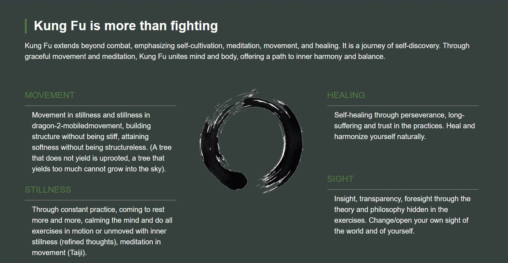

- __Training-Page: Kung Fu Styles__
    - In this section the user gets an general overview of the different Kung Fu styles he can learn at this school.
    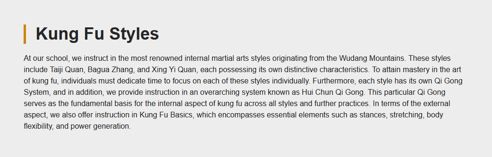

- __Training-Page: Tabbed Style Section__ 
    - This section provides in-depth information for each individual style. 
    - The included videos support and help the user to gain a clearer understanding of the specific styles.
    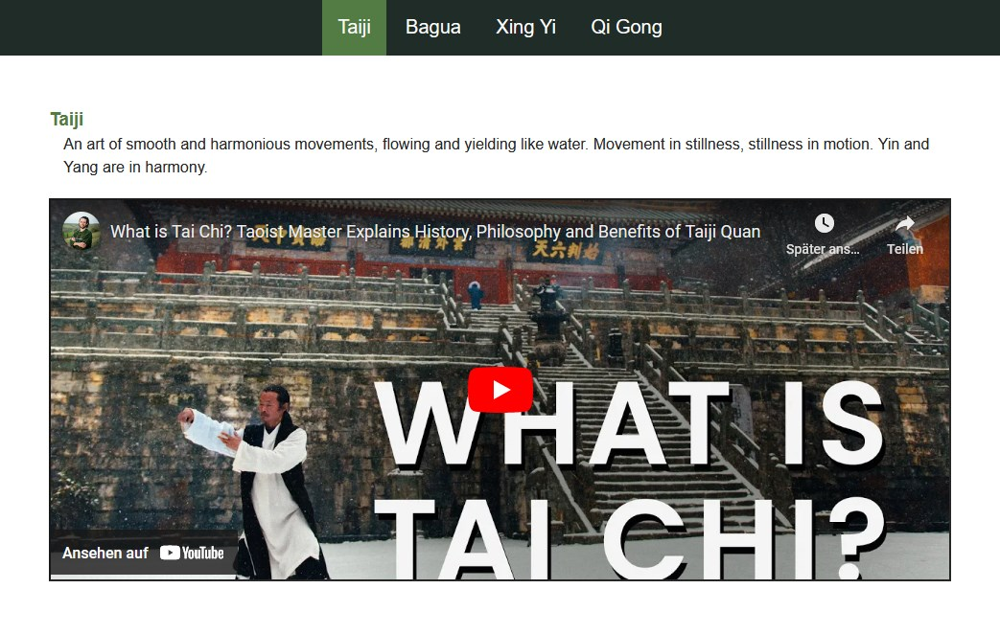

- __Training-Page: The art of Kung Fu includes ...__
    - This section explains the various purposes of Kung Fu. This information is referenced in the training schedule below.
    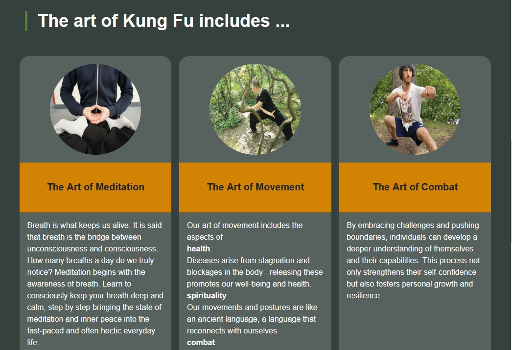

- __Training-Page: Training Schedule__
    - This section displays the training schedule and provides information for the user about the timing of each class.
    - The colors used here indicate the type of training the user can expect when joining one of these classes.
    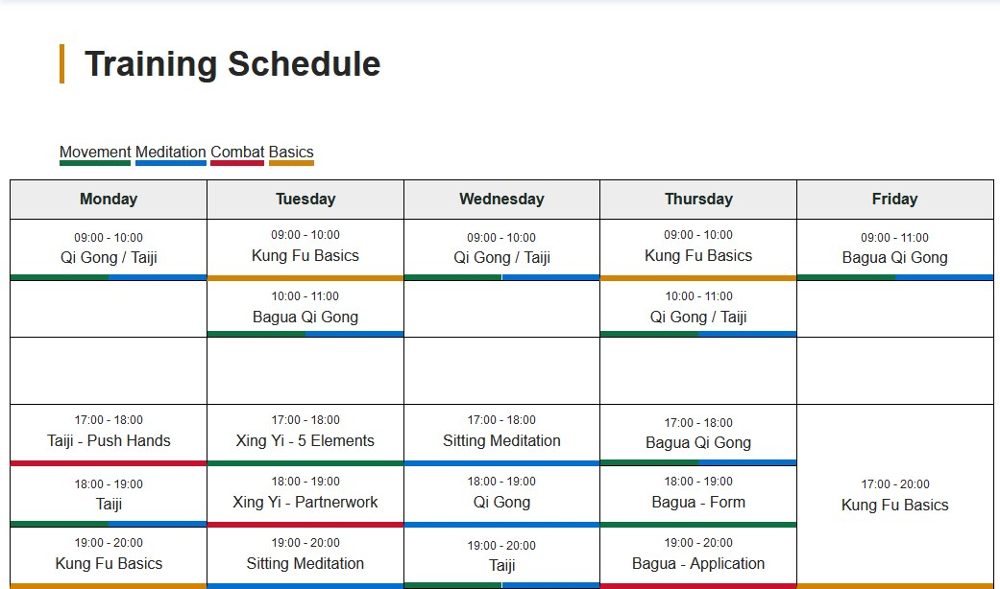

- __Price-Page: Pricing Cards__
    - This section displays the different price categories available to the user and what each of them offers. 
    - These categories are designed to cater to the various needs of the students, recognizing that everyone has different financial circumstances. The aim is to make the training accessible to a wide range of individuals.
    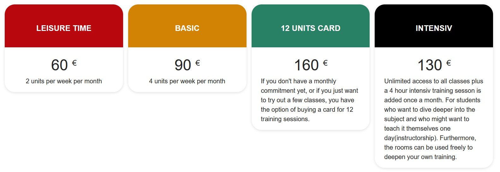

- __Contact-Page: Form__ 
    - This section offers a convenient way to contact the school.
    - Users have the opportunity to ask questions or request information about the school or the training.
    - After submitting the form, the user will be redirected to a Thank You Page.
    - This form includes 4 fields: 
        - Name: The full name of the user
        - Email: The email address of the user, where he can be contacted by the school. The email address has to be entered in a correct format xxx@xxx.xx
        - Subject: A topic for his request / question 
        - Message: The message
    - All of those fields are mandatory.
    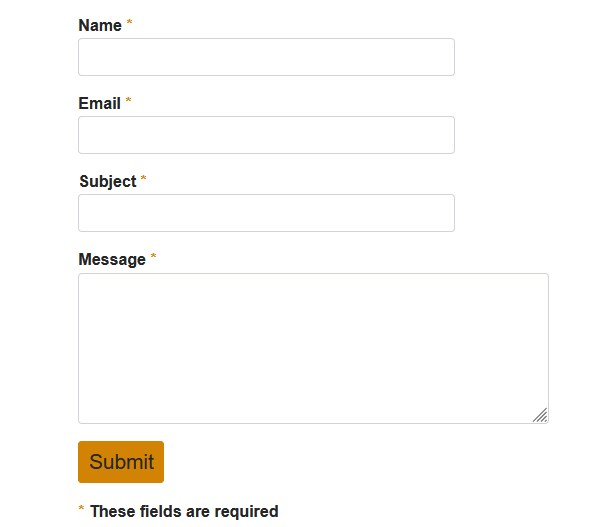

- __Thank You Page__
    - Provides feedback to the user that their message has been sent successfully to the school. 
    - This page can be accessed by sending a message via the contact form. 
    - This page is a static page, displaying a successfully send message every time.
    

- __404 Page__
    - This page is designed to display a 404 error page to the user instead of an empty page when he enters an incorrect URL.
    - In the event of site refactoring or changed links, users will receive informative feedback instead of encountering a blank screen.
    

- __Footer__ 
    - The footer can be found on all pages.
    - The footer section includes contact information that allows the user to easily get in touch with the school, ensuring a seamless and convenient way to reach out for inquiries, assistance, or feedback.
    - The footer section includes links to the relevant social media sites. The links will open to a new tab to allow easy navigation for the user. The footer is valuable to the user as it encourages them to keep connected via social media.
    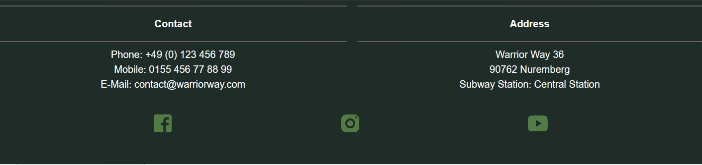

### Future Features
The following features are not available in this release, but will be implemented in the future. 

   - __Contact form sending to an actual email__
        - Because this site needs to remain a static HTML website for the current state, I haven't implemented this feature yet. However, it is definitely planned for the future to ensure the proper usage of this contact form.

## Test
Before deploying this site, it's essential to thoroughly test it to ensure that everything is functioning as expected. 
Following tests have been run:

### 1. Open in Local Browser
To start testing this site, open it in your local web browser. 
Ensure that this website is accessible via internet. 
| Description                                   | Action                                                                   | Expexted Result                              | Pass/Fail |
| --------------------------------------------- | ------------------------------------------------------------------------ | -------------------------------------------- | --------- |
| Test: The site is accessible via the internet | type in url(https://pbrdys.github.io/way-of-the-warrior/) in any browser | Site is opening and displayed in the browser | Pass      |

### 2. Cross-Browser Compatibility
Test this site in multiple web browsers to ensure it works consistently accross different platforms.
| Description                      | Action                                                      | Expexted Result                              | Pass/Fail |
| -------------------------------- | ----------------------------------------------------------- | -------------------------------------------- | --------- |
| Test: Open site in Firefox       | type in [url](https://pbrdys.github.io/way-of-the-warrior/) | Site is opening and displayed in the browser | Pass      |
| Test: Open site in Google Chrome | type in [url](https://pbrdys.github.io/way-of-the-warrior/) | Site is opening and displayed in the browser | Pass      |
| Test: Open site in Edge          | type in [url](https://pbrdys.github.io/way-of-the-warrior/) | Site is opening and displayed in the browser | Pass      |
| Test: Open site in Safari        | type in [url](https://pbrdys.github.io/way-of-the-warrior/) | Site is opening and displayed in the browser | Pass      |

### 3. Responsivity Testing
With the increasing use of mobile devices, it's crucial to test your site's compatibility with various devices and screen sizes. This tests cover mobile phones, tablets and bigger screen sizes. 
Dev Tools were used for testing. To open the Developer Tools, just click F12 in your browser. 

| Description                                                                                        | Action                                        | Expexted Result                                                                                                                                                                                                                             | Pass/Fail |
| -------------------------------------------------------------------------------------------------- | --------------------------------------------- | ------------------------------------------------------------------------------------------------------------------------------------------------------------------------------------------------------------------------------------------- | --------- |
| Test: Images on all pages are displayed correctly and are not pixled or stretched                  | Change Dimension to 250px, 610px and > 1100px | All Images on all pages are displayed properly, clear and visible                                                                                                                                                                           | Pass      |
| Test: Videos on all pages are displayed correctly and are not pixled or stretched                  | Change Dimension to 250px, 610px and > 1100px | All Videos on all pages are displayed properly, clear and visible                                                                                                                                                                           | Pass      |
| Test: All Pages are responsive                                                                     | Change Dimension to 250px, 610px and > 1100px | All sections should shrink and grow with the screen size, margins and paddings should be harmonious on all different screen sizes, text should wrap and not overlap, font-size is displayed proportionaly to the screen size,               | Pass      |
| Test: Elements change from flex-direction row to column if needed to dsiplay the content correctly | Change Dimension to 250px, 610px and > 1100px | All elements behave correctly: \-  Kung Fu is more than fighting section \- The art of Kung Fu includes \- Pricing Table \- Footer                                                                                              | Pass      |
| Test: Navigation bar                                                                               | Change Dimension to 250px, 610px and > 1100px | Hamburger icon displayed 250 - 610 \> 610 Hamburger icon disappears, navigation bar links are being displayed, Navigation Bar Logo and Title are being resized Hamburger icon is not overlappint Logo and Title at min width 250px | Pass      |

### 4. Functionality Testing
Test all interactive elements on this site such as: 
- Navigation links, Footer links
- All available buttons
- Contact Form 
- Tab Functionality on Training-Page (javascript)

| Description                                                                        | Action                                                                                                                            | Expexted Result                                                                                                                                                                                            | Pass/Fail |
| ---------------------------------------------------------------------------------- | --------------------------------------------------------------------------------------------------------------------------------- | ---------------------------------------------------------------------------------------------------------------------------------------------------------------------------------------------------------- | --------- |
| Test: Navigation Bar Links go to correct page                                      | school -> index.html Training -> training.html Price -> price.html Contact -> contact.html                               | Nav links go to correct page from each page                                                                                                                                                                | Pass      |
| Test: Social Media Link go to correct page and open in a new tab                   | Click each social media link fb-icon -> www.facebook.com youtube-icon -> www.youtube.com insta-icon -> www.instagram.com | Social links go to correct page and open in new tab                                                                                                                                                        | Pass      |
| Test: Buttons navigate to correct page                                             | Click each button                                                                                                                 | school -> more information -> goto: training.html contact -> submit -> goto: thank-you.html thank you -> go back to homepage -> goto: school.html 404 -> go back to homepage -> goto: school.html | Pass      |
| Test: Traning Page Tabs work correctly                                             | Click each tab in training.html \- Taiji \- Bagua \- Xing Yi Qi Gong                                                  | Shows different content for each clicked tab                                                                                                                                                               | Pass      |
| Test: Videos don't start to play automatically , but play properly if pressed play | Click each video in training.html                                                                                                 | Video is playing                                                                                                                                                                                           | Pass      |
| Test: Contact Form - mandatory fields                                              | Fill out all fields in Contact Form and submit                                                                                    | Navigate to thank you page                                                                                                                                                                                 | Pass      |
| Test: Contact Form - mandatory fields                                              | Fill out all fields except one field: Test for each field: Name, Email, Subject, Message                                       | Message: Please fill out all required fields appears at the empty field                                                                                                                                    | Pass      |
| Test: Contact Form - Email field                                                   | Type in wrong email address format                                                                                                | Message: Please type in a valid email address                                                                                                                                                              | Pass      |

### 6. Contrast Testing
The colors on this site were chosen to harmonize with each other. 
Colors used: 
- Primary: #527C43; (light green)
- Secondary: #202C28; (dark green)
- Accent: #d28303; (orange)

WAVE Web Accessibility Evaluation Tool was used to assess the accessibility of web pages and identify potential issues or barriers for people with disabilities.
| Description                                                             | Action                         | Expexted Result                                                      | Pass/Fail |
| ----------------------------------------------------------------------- | ------------------------------ | -------------------------------------------------------------------- | --------- |
| Test: Every page contains an h1 tag                                     | Open every page and run "WAVE" | Every page contains exactly one h1 tag                               | Pass      |
| Test: Every page has a correct heading hirarchy, no heading was skipped | Open every page and run "WAVE" | Every page has the right heading hirarchy. From 1 to 4               | Pass      |
| Test: Every image has an alt-text                                       | Open every page and run "WAVE" | Every image has an meaningful alt-text                               | Pass      |
| Test: Contrast of all page elements matches the accessibility criteria  | Open every page and run "WAVE" | Every part of the page meets the contrast criteria for accessibility | Pass      |
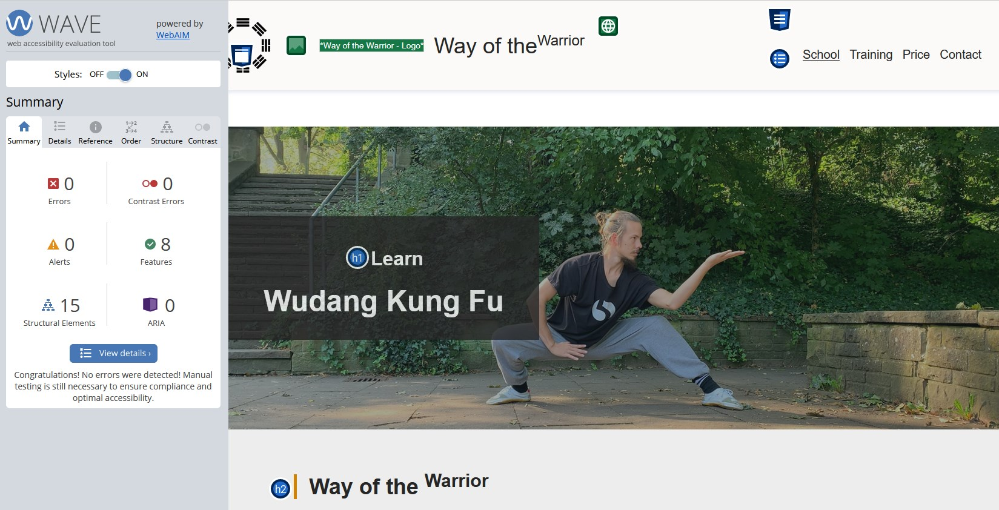

### 7. Validator Testing 
- HTML
  - No errors were returned when passing through the official W3C validator.
  - Test run for all pages: index.html, training.html, price.html, thank-you.html, contact.html, 404.html
  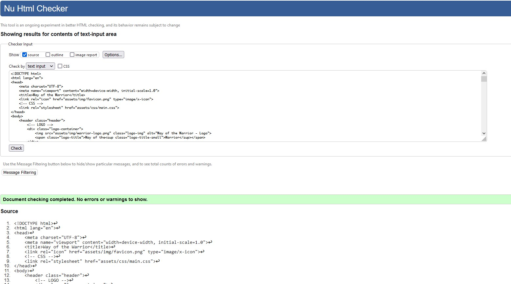
- CSS
  - No errors were found when passing through the official (Jigsaw) validator.
  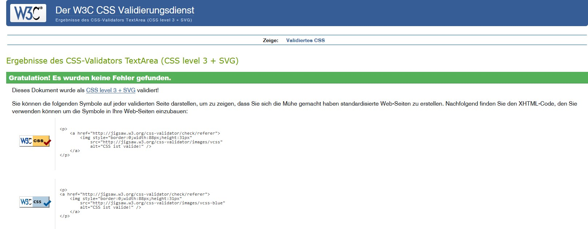

## Bugs 
| Expected behaviour                         | Bug description                                | When / How does it appear?                        | Solution                        |
| ------------------------------------------ | ---------------------------------------------- | ------------------------------------------------- | ------------------------------- |
| All Pages are responsive and don't overflow| Training Schedule in training.html overflowing | DevTools -  Dimension 250px width (mobile device) | overflow-x: scroll added to css |

Image of the Bug: 
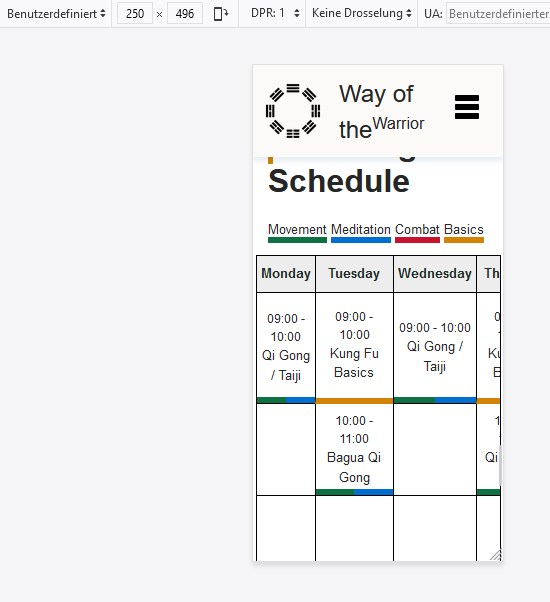

## Deployment
After this site has been tested successfully and it passed all those tests, it's time to deploy this site to a live server
or hosting environment. 
Here's a step-by-step guide on how to deploy this site:

### 1. Version Control (GitHub)
All files has been commited during the development process to GitHub.
    File Structure: 
        - HTML Files (all used pages)
        - assets/img (all used images for the site)
        - assets/js (javascript used for this site)
        -doc (all images used for this documentation)

### 2. Git Commands used during the development
    - git add .                                     |       Add all changes to the next commit
    - git commit -m "commit message here"           |       Commit the added changes
    - git push                                      |       Finally push the changes to the git repository

### 3. Deploy site
I deployed the site using GitHub Pages. The steps were:
    - On the GitHub page for this project, go to the 'Settings' menu
    - Go to 'Pages'
    - Under 'Build and deployment > Branch', select 'main'
    - Click 'Save'
    - From now on the site will be accessible at a URL like `https://pbrdys.github.io/way-of-the-warrior/`.

## Credits

### Media
- The social media icons used in the footer were take from https://icons8.com/icon/set/social-media/material
- All images used in this website are made, designed, created by me
- All written information were made by me
- For developint the form, i used the Love Running project as inspiration 

#### Reference documents used: 
- CodeInstitute HTML and CSS course material
- CodeInstitute 'LoveRunning' walkthrough project guidance 
- [Mozilla Developer Network](https://developer.mozilla.org/en-US/) documentation on HTML and CSS